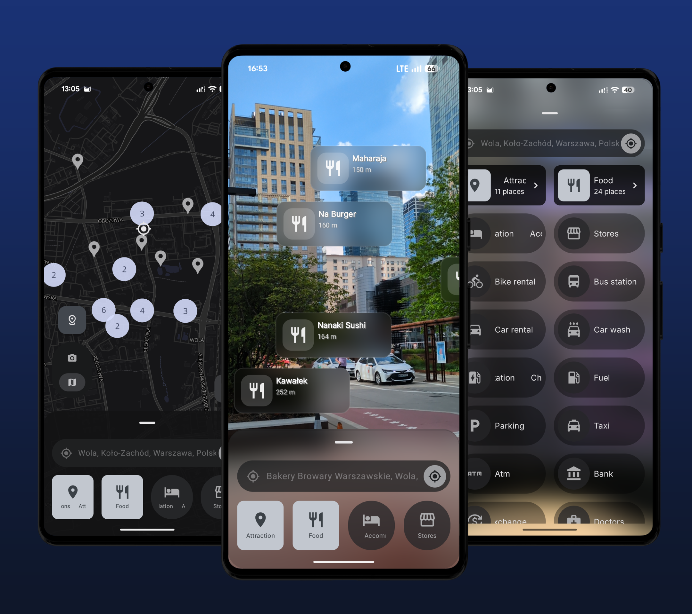
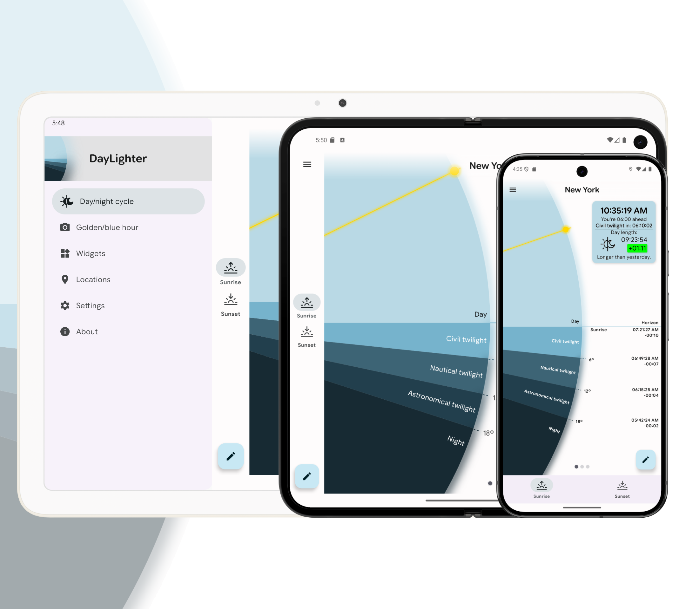
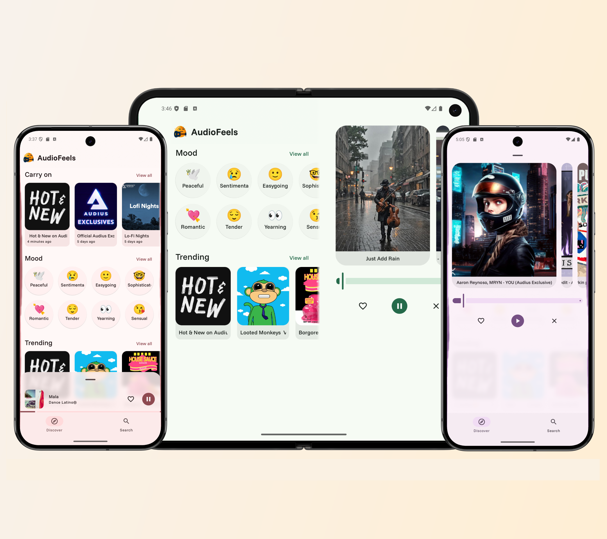
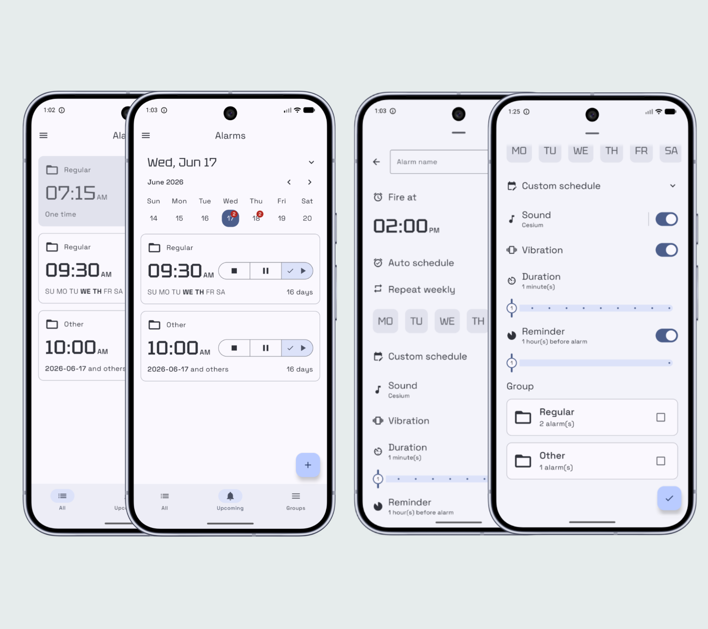
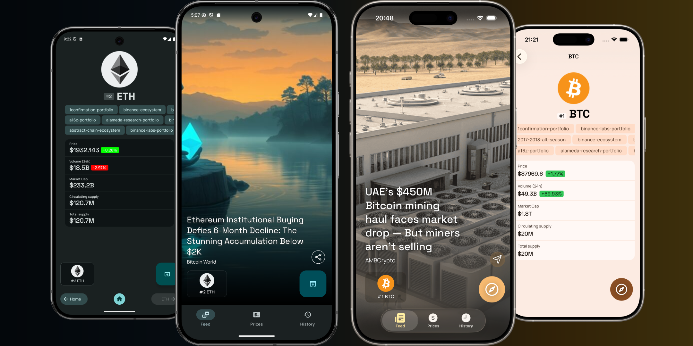
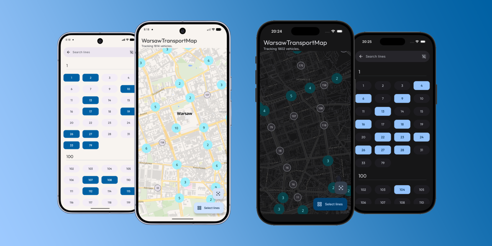

## Welcome

These are some of my projects.
<!-- This version is safest for GitHub READMEs -->
<table>
  <tr>
    <th><a href="https://github.com/tosoba/Sightline">Sightline</a></th>
    <th><a href="https://github.com/tosoba/DayLighter">DayLighter</a></th>
  </tr>
  <tr>
    <td></td>
    <td></td>
  </tr>
  <tr>
    <th><a href="https://github.com/tosoba/AudioFeels">AudioFeels</a></th>
    <th><a href="https://github.com/tosoba/Alarmist">Alarmist</a></th>
  </tr>
  <tr>
    <td></td>
    <td></td>
  </tr>
  <tr>
    <th><a href="https://github.com/tosoba/CryptoSphere">Cryptosphere</a></th>
    <th><a href="https://github.com/tosoba/WarsawTransportMap">WarsawTransportMap</a></th>
  </tr>
  <tr>
    <td></td>
    <td></td>
  </tr>
</table>

* [Sightline](https://github.com/tosoba/Sightline) - **location-based AR** (augmented reality) Android app utilizing camera and map previews.
* [DayLighter](https://github.com/tosoba/DayLighter) - Material 3 themed android app for **tracking dusk/dawn phases** as well as golden/blue hours.
* [AudioFeels](https://github.com/tosoba/AudioFeels) - Compose Multiplatform **audio player** for [Audius](https://audius.co/), built for simple, mood-based playlist matching.
* [Alarmist](https://github.com/tosoba/Alarmist) - Material 3 themed Compose Multiplatform app for **creating and managing alarms** using groups and home screen widgets.
* [CryptoSphere](https://github.com/tosoba/CryptoSphere) - Kotlin Multiplatform **cryptocurrency news feed** app that utilizes [Coinstats](https://coinstats.app/) and [CoinMarketCap](https://coinmarketcap.com/) APIs.
* [WarsawTransportMap](https://github.com/tosoba/WarsawTransportMap) - Compose Multiplatform app for **tracking live positions of public transport vehicles** in Warsaw which utilizes [UM](https://api.um.warszawa.pl/) API.
